# User Guide

## Introduction

Hello! Thank you for choosing to use PulsePilot!

Our team appreciates that you are giving our space-themed health application a try, and we hope that it helps you document your recovery journey better and bounce back from whatever injury you are facing.

This document serves as the **User Guide** of PulsePilot, designed to help you (an injured athlete) learn what PulsePilot is about, our motives, how to install it and how to use it.

Learning to use software can be daunting. Thus, this guide was created for **non-technical users**, helping you unleash PulsePilot to its fullest potential! That being said, we assume that you know how to use the basic features on your computer, such as **downloading files or copying and pasting text from one program to another**.

Once again, we hope our application helps you, and thank you for choosing PulsePilot, and we hope you recover as fast as possible!

> ❗ This is the **inexperienced user guide**. The **experienced** user guide for users familiar with installing PulsePilot, Java, using the terminal can be found [here](https://ay2324s2-cs2113t-t09-4.github.io/tp/UserGuide.html).

## Contact Us

If you have any queries with the guide, our application, or even life in general,  please feel free to reach out to our project director **Justin Soh** at [+65 91234567](https://www.youtube.com/watch?v=eBGIQ7ZuuiU)!

---

## Table of Contents

* [How to use this guide](#how-to-use-this-guide)
  * [Glossary Usage](#glossary-usage)
  * [Blocks](#blocks)
* [About PulsePilot](#pulsepilot)
  * [What is it?](#what-is-it)
  * [Origins](#origins)
* [Command Line Interface](#command-line-interface)
* [Installation](#installation)
* [PulsePilot Commands](#pulsepilot-commands)
* [Command Summary](#command-summary)
* [Frequently Asked Questions](#frequently-asked-questions)
* [Glossary](#glossary)

---

## How to use this guide

Before we delve into the content of what is PulsePilot and how to use it, we want to let you know and get familiar with the styling used in this guide, so that this guide can help you better!

### Glossary Usage

This guide may have difficult to understand technical jargon or terms used. Fret not! We understand that seeing such terms can be daunting to someone not familiar with it.

As such, our team has created a **Glossary** for you to refer to when reading this guide! It serves as a mini-dictionary, for you to read a definition and quickly go back to wherever you were.

Technical terms are marked in **italicised blue** [*like this*]()! When you click on it, it brings you to the glossary. Each term in the glossary also contains a 'Go back' button, and clicking on that returns you to where you originally were. This is to create a seamless reading experience for you! 

Note that only **the first instance** of a term will be hyperlinked!

Give it a try with the term: [*Object-Oriented Programming*](#glossary).

The blue phrases known are also known as [*hyperlinks*](#glossary).

Non-italicised hyperlinks [like this]() are used to bring you to different parts of the document.

For example, **the one below to bring you back to the table of contents on top!**

###### [Back to table of contents](#table-of-contents)

---

### Blocks

There are 3 different kinds of **blocks**, denoted using different **icons** to bring things to your attention.

> 💡 This is an **information** block. It is used to highlight **additional** details that you might be interested in!

> ⚠️ This is a **warning** block. It is used to highlight key information that **may** be useful for you!

> ❗ This is an **important** block. It contains information that you **MUST READ**! Take note of these!

###### [Back to table of contents](#table-of-contents)

---

## PulsePilot

### What is it?

PulsePilot is an application made by 6 computing students from the National University of Singapore (NUS) that helps you (the user) document each stage of your recovery journey better! More specifically, it was coded in [*Java*](#glossary).

The application is built for **both** healthcare professionals and patients. Using PulsePilot, patients can better record their recovery progress from an injury, as well as general well-being. 

Healthcare professionals on the other hand would use PulsePilot to view the information that a patient has logged, allowing them to better keep tabs on their patients' recovery status outside the hospital.

At the time of writing, you can do the following with PulsePilot:

  - Keep training logs of **both run and gym** workouts.
- Store information of your **past menstrual cycles and make predictions of future cycles**.
- Record past or present **medical appointment** information.
- Keep a log of your **Body Mass Index (BMI)**.  

More details about how to [install](#installation) and use [PulsePilot](#pulsepilot-commands) are covered below!

###### [Back to table of contents](#table-of-contents)

---

### Origins

On top of being NUS Computing students, our team members are all competitive athletes who have had past injuries and hence dealt with the healthcare system in Singapore.

We came together and realised that one common denominator was our unhappiness with the level of service received from the healthcare system when we were injured. We want to use our experience and knowledge about creating software learned from our university course to better the lives of all athletes in Singapore.

We have done extensive research onto this problem, as well as received testimonials from both varsity and national-level athletes about their recovery experiences. In general, they too were unhappy with the level of service received.

The 2 main problems identified from our study were:

1. Poor communication between **healthcare professionals and patients** inhibiting medical progress:
 This can be caused by the long waiting periods in between sessions, by a patient seeing more than 1 specialist at a time or from the specialist having too many patients to monitor.

2. **Data Fragmentation**:
  As mentioned above, a patient can see many specialists, thus resulting in their information and hence recovery status being **spread out across different clinics, hospitals and people**. There is **no centralised system** for doctors to read patient data and for patients to update all doctors simultaneously.

The above problems gave rise to PulsePilot, the guide for which you are reading right now! PulsePilot was designed with both patients and healthcare professionals in mind to solve the 2 main problems identified above!

We hope that PulsePilot can bridge the information gap between you and your doctor, and we wish you a speedy recovery. D

> ❗ This application is still in [*beta phase*](#glossary). As such it is not complete and more features will be added in future versions. Stay tuned for updates!

###### [Back to table of contents](#table-of-contents)

---

## Command Line Interface

> 💡 This section explains what a [*Command Line Interface (CLI)*](#glossary) is. If you are already familiar with this, please feel free to move on to the [installation section](#installation) .

> ⚠️ For **inexperienced** users, if you are not familiar with what the CLI is, keep reading this section. PulsePilot is built to be run using the CLI, and its [*commands*](#glossary) are also entered through the CLI!

Let us begin exploring the [*Command Line Interface (CLI)*](#glossary)! This section is further broken down into the 2 most common operating systems: Windows and macOS. Remember that PulsePilot can be run on **any operating system with Java installed**!

Here is a sub table of contents, so you can navigate through this section easily:

* [Windows](#windows)
  * [Launching `cmd.exe`](#launching-cmdexe)
  * [Windows Commands](#windows-commands)
* [MacOS](#macos)
  * [Launching `bash`](#launching-bash)
  * [MacOS Commands](#macos-commands)

###### [Back to table of contents](#table-of-contents)

---

### Windows

#### Launching `cmd.exe`

Let us first begin with launching the command line for Windows. The name of this program is `cmd.exe`!

To do so, firstly, hit the <kbd>Windows</kbd> key on your keyboard to bring up the start menu:

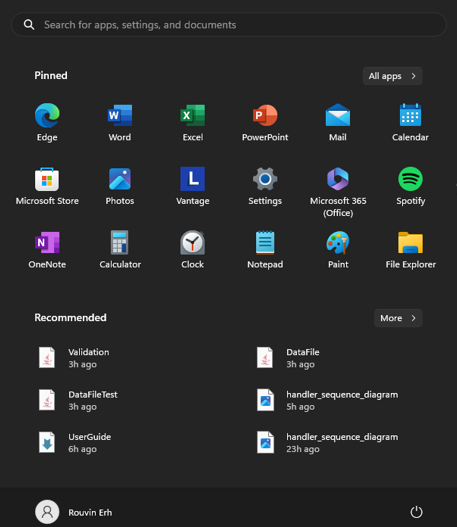

Afterward, type `cmd` or `Command Prompt` into the search bar above, and there should be 1 program found called the '**Command Prompt**'.

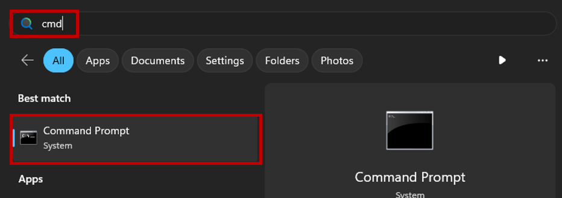

Go ahead and click on that, and a black screen should pop up on your screen looking like this:

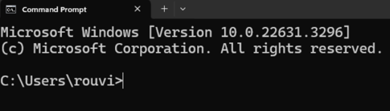

Congratulations, you have successfully launched the CLI for Windows!

The string `C:\Users\rouvi` is the current [*directory*](#glossary) that you are in! This means that currently, the CLI is within the `C:\Users\rouvi` folder of the computer.

> ❗ The directory and CLI for you may look different from the one shown in the guide! This is **normal** as the guide was created using a different computer. As long as the top of the window shows '**Command Prompt**', you are good to go!

You can type different things into the CLI, and press <kbd>Enter</kbd> to make your computer read the input and process it as a command.

For the example below, I typed a `hello` and hit <kbd>Enter</kbd> to make the compute read it.

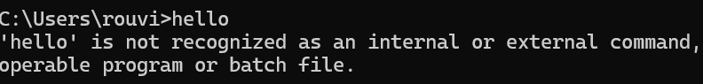

`hello` is not a valid command to use with `cmd.exe`, and your computer will let you know it is not a recognised command as shown in the image above.

Read the next section to learn some basic commands!

###### [Back to Command Line Interface](#command-line-interface)

###### [Back to table of contents](#table-of-contents)

---

#### Windows Commands

##### Changing Directories

There are many commands in Windows, but this guide will cover the basic few you need to use PulsePilot.

The first command is `cd`, short for **change directory**. It changes the **current** directory to the specified one. The format to use it is `cd <DIRECTORY>`, where `<DIRECTORY>` is something you pick!

For example, suppose I want to go to the `cli_demo` folder from my current directory. I would type the following:

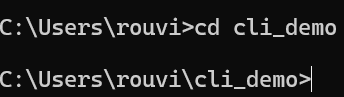

Note how `C:\Users\rouvi` now has `\cli_demo` appended to the back. This means that the directory has been changed successfully.

If you `cd` to a directory that does not exist, your terminal will let you know it cannot find such a directory:

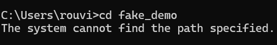

If you want to go 'back' one directory, use `cd ..`.

> 💡 `..` means the previous directory.

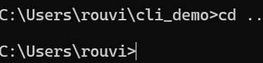

##### Listing Directories

Now, suppose you want to view files a directory has within it. You can use `dir` to do so. 

For example, I want to view what files are within the `cli_demo` folder. I would first `cd` to the `cli_demo` folder, and then use `dir` to view the output:

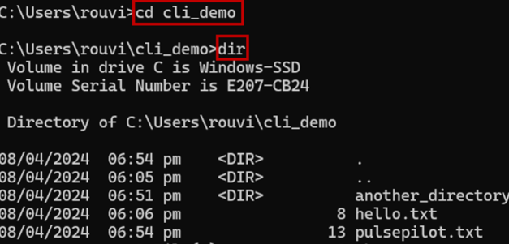

This would print out all the folders within the directory. In the `cli_demo` directory, I have a `hello.txt` and a `pulsepilot.txt` file. 

I also have another folder within `cli_demo` called `another_directory`. Your computer differentiates between files and directories using the `<DIR>` string printed before the name of the file or folder.

That is all the commands you need to know to navigate through the Windows CLI and use PulsePilot! To summarise:

* `dir` - Lists the files and directories in the current directory.
* `cd <DIRECTORY>` - Changes the current directory to the specified one.

###### [Back to Command Line Interface](#command-line-interface)

###### [Back to table of contents](#table-of-contents)

---

### MacOS

#### Launching `bash`

On macOS, the default command line interface is called the Terminal, which uses the Bash shell. To launch the Terminal:

Open the Launchpad
Search for "Terminal" and click on the application to open it
The macOS Terminal allows you to enter and execute Bash commands.

MacOS Commands
Here are some common Bash commands you can use in the macOS Terminal:

ls - Lists the files and directories in the current directory
cd <directory> - Changes the current directory to the specified one
clear - Clears the screen of the Terminal
exit - Closes the Terminal window

###### [Back to Command Line Interface](#command-line-interface)

###### [Back to table of contents](#table-of-contents)

---

#### MacOS Commands

list directory, change directory, invalid commands.

###### [Back to Command Line Interface](#command-line-interface)

###### [Back to table of contents](#table-of-contents)

---

## Installation

Now that you are familiar with the CLI, it is time to install Java and PulsePilot!

The installation for Java is different for Windows and macOS computers. However, the installation and launching of PulsePilot is the same for both operating systems!

* [Installing Java](#installing-java)
* [Installing and Launching PulsePilot](#installing-and-launching-pulsepilot)

### Installing Java

> 💡 If you already have Java 11 installed, feel free to skip to the [next section](#pulsepilot-commands) to learn about the commands for PulsePilot.

A specific version of Java will be required for PulsePilot, thus this part of the guide will bring you through the installation of Java 11.

A guide to install Java can be found [here](https://nus-cs2030.github.io/1920-s2/contents/guides/settingUpJava.html), as many other NUS modules use a similar version of Java for their projects.

>❗Although the website says it is for CS2030 from a previous semester, the steps are the same.

To ensure that you have the correct version of Java installed, launch the CLI (either `cmd.exe` or `bash`) and run `java --version`.

As long as the output shows `java 11` is installed, it is correct. The specific version 

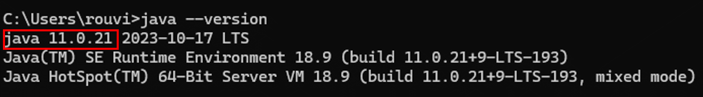

###### [Back to Installation](#installation)

###### [Back to table of contents](#table-of-contents)

---

### Installing and Launching PulsePilot

> 💡 If you already have PulsePilot installed, feel free to skip to the [next section](#pulsepilot-commands) to learn about the commands for PulsePilot.

PulsePilot can be installed from our team's [*GitHub*](#glossary) repository [here](https://github.com/AY2324S2-CS2113T-T09-4/tp/releases/tag/v2.1).

The screen should have the following hyperlinks as shown below, and clicking on `pulsepilot.jar` will download the application to your Downloads folder.

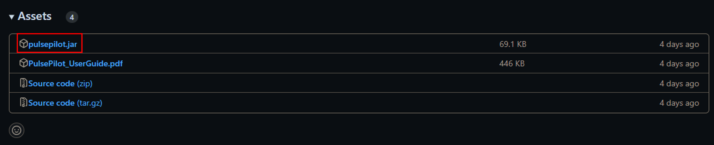

Afterwards, launch the CLI, `cd` to your Downloads folder, and run `java -jar pulsepilot.jar`. If Java has been installed correctly, and you are in the correct directory, PulsePilot will launch successfully.

Your terminal should look like this below, with PulsePilot asking for your name.

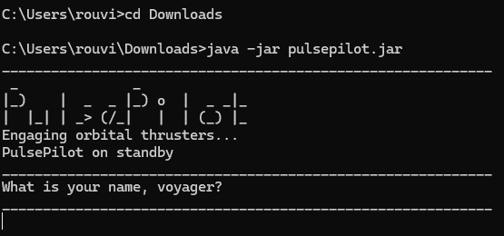

> 💡 PulsePilot is spaced themed, thus the space terms in the introduction it displays on screen! 🚀🚀

> ❗ This process is the exact same for **both Windows and macOS!**

###### [Back to Installation](#installation)

###### [Back to table of contents](#table-of-contents)

---

### Common Problems

> 💡 If you do not face any issues with launching PulsePilot, feel free to skip to the [next section](#pulsepilot-commands) to learn about the commands for PulsePilot.

This section will address some common problems users will face.

#### Wrong Directory

When attempting to launch `pulsepilot.jar` from the wrong directory, this error will appear:

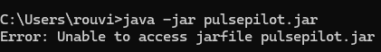

This means that `pulsepilot.jar` is **not within your current directory**. To remediate this, use `dir` to check for the files present within your current directory.

If you are in the right directory, `pulsepilot.jar` should appear like so:

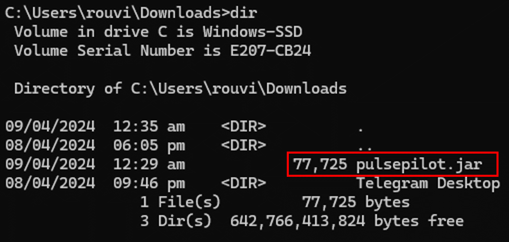

##### Windows Fix

To fix this, do the following:

1. Find where `pulsepilot.jar` is within your machine using the [*File Explorer*](#glossary).

2. Right click on it and click on **Properties**.
  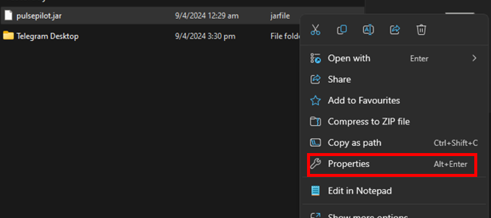

3. A separate window will appear with additional data for `pulsepilot.jar`. Copy the value of the **Location** part of the Properties window using <kbd>Ctrl + C</kbd> or highlighting the text, right-clicking it and selecting **Copy**.
  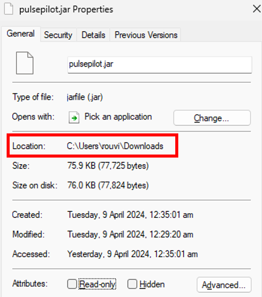

4. Once copied, open the CLI for your device, and type `cd` and hit the <kbd>Spacebar</kbd> **once**, then paste the **Location** value you just copied using <kbd>Ctrl + V</kbd>. Then, hit <kbd>Enter</kbd>. You should see that you are now in the right directory, and use `dir` to verify that `pulsepilot.jar` is within this current directory.
  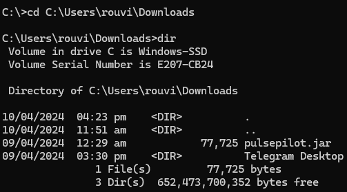

5. Continue to launch PulsePilot using `java -jar pulsepilot.jar`.

##### macOS Fix

###### [Back to Installation](#installation)

###### [Back to table of contents](#table-of-contents)

---

## PulsePilot Commands

Now that Java and PulsePilot is up and running on your computer, it is time to learn how to use PulsePilot via its implemented commands and [*flags*](#glossary).

> ⚠️ For **experienced** users, if this is not your first time using a CLI application or PulsePilot, feel free to skip ahead to the [experienced user manual](#experienced-user-manual)! If not, please continue reading!

* [PulsePilot Text Style](#pulsepilot-text-style)
* [Creating Your Profile](#creating-your-profile)
* [Viewing Help](#viewing-help)
* [Workout](#workout)
  * [Add Run](#add-run)
  * [Add Gym](#add-gym)
* [Health](#health)
  * [Add Period](#add-period)
  * [Add BMI](#add-bmi)
  * [Add Appointment](#add-appointment)
  * [Make Period Prediction](#make-period-prediction)
* [View History](#view-history)
* [View Latest](#view-latest)
* [Delete Item](#delete-item)
* [Storage of Data](#storage-of-data)
* [Exit](#exit)

### PulsePilot Text Style

The text in the step-by-step guide have been colour coded to help you better understand the commands, as it can get a bit confusing!

There are 3 colours used in the guide: <u>White</u>, red and green, each used for a different kind of text:

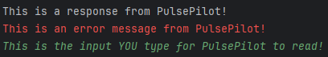

- A response is merely a message from PulsePilot.
- An error indicates that PulsePilot has detected some invalid input from you. Read the error messages to find out what's wrong!
- Your input represents the command **you** type and press 'Enter' for PulsePilot to use!

> ❗If you are not seeing colours on your screen, and instead see **odd characters** like `[` or `<-`, please read our [*troubleshooting guide*](#odd-characters-on-screen) for this issue!

> ❗The colours on your own screen may be different, or it may not even be colour-coded at all. The colours are just visual cues for **this guide**!

###### [Back to PulsePilot Commands](#pulsepilot-commands)

###### [Back to table of contents](#table-of-contents)

---

### Creating Your Profile

When you first run PulsePilot, it will prompt you for your name as follows:

You can enter your real name or an alias. PulsePilot only checks that you enter **[*alphanumeric*](#glossary) characters and spaces**. For example, `Justin Soh` is a valid name!

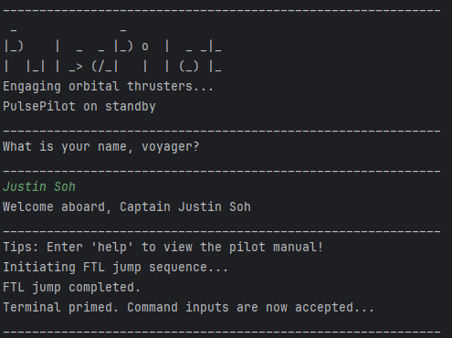

After setting your name, **you are ready to use PulsePilot**!

> ❗Entering usernames that have non-alphanumeric characters, such as `;` or `|` will trigger an error!
> 
>  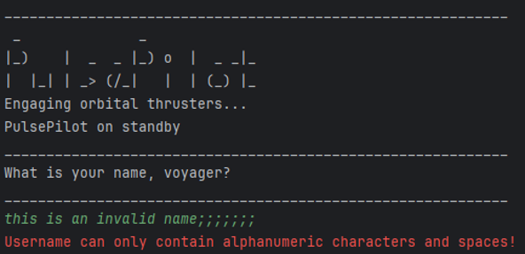
> 
> If this happens, not to worry! You can simply **re-enter a valid name** and PulsePilot will continue to work normally.
>
> 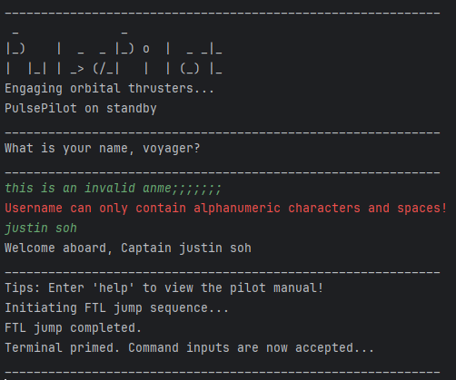

###### [Back to PulsePilot Commands](#pulsepilot-commands)

###### [Back to table of contents](#table-of-contents)

---

### Viewing Help

This command displays the help message, which has information about all the other commands in PulsePilot.

1. When you enter `help`, PulsePilot prints out the help message.

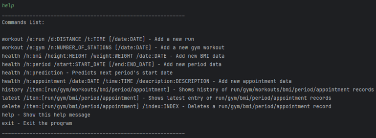

> 💡 You can use this **as many times as you need** to get a quick summary for all the commands!

> ❗ Having extra characters after the first `help` word will be ignored! `help me` and `help` both print the same output with no issues.

###### [Back to PulsePilot Commands](#pulsepilot-commands)

###### [Back to table of contents](#table-of-contents)

---

### Workout

Being a health-tracking application, PulsePilot can record Run and Gym sessions. This is implemented via the `workout` command.

There are 2 types of exercises that can be recorded, denoted using the `/e:` flag.

- To add a run session, use `workout /e:run`.
- To add a gym session, use `workout /e:gym`.

There are details and flags required from you, which will be covered below.

---

#### Add Run

> 💡PulsePilot automatically calculates the pace of your run for you in minutes/km (i.e. `5.00/km`). This helps you track your progress better!

To add a run, the following details and flags must be specified in your input:
| Detail     | Description                                                       | Flag Used | Limitations                                                                                                                                                                  |
|------------|-------------------------------------------------------------------|-----------|------------------------------------------------------------------------------------------------------------------------------------------------------------------------------|
| `distance` | The distance ran in **kilometres**.                               | `/d:`     | Must be a **2 decimal point positive number** such as `5.15`.   Must be **at least** `0.01`, and is **capped at** `5000.00`.                                          |
| `time`     | The time taken for the run.                                       | `/t:`     | Must be in either `MM:SS` or `HH:MM:SS` format.   Must be **at least** `00:01`, and is capped at `99:59:59`.                                                          |
| `date`     | The date of the run.  This is an **OPTIONAL** parameter.   | `/date:`  | Must be in `DD-MM-YYYY` format.   Date specified **cannot be after today's date**. (i.e. If today is `10-04-2024`, specifying `11-04-2024` will trigger an error!)    |

> ❗ The `date` parameter is **OPTIONAL**. Not specifying one results in it being recorded as `NA` within PulsePilot, and it is okay!

> ❗ If the `HH` field in `time` is not needed and set to `00`, **an error message will be printed!**

The following example will cover how to add a run step-by-step.

1. Suppose you want to add **two** runs:

   - The first is a  **5.50km** run completed in **25 minutes and 12 seconds** on **7 March 2024**.
   - The second is a **20km** run completed in **2 hours, 13 minutes and 37 seconds** without a date.

2. Let's put the **first** run's details into the flags required:

    - A **5.50km** run is specified using the `distance` flag via `/d:5.50`.
    - **25 minutes and 12 seconds** is specified using the `time` flag via `/t:25:12`.
    - **7 March 2024** is specified using the `date` flag via `/date:07-03-2024`.

3. Putting it together, the full command is:

   <code style="color: #D85D43;">workout /e:run /d:5.50 /t:25:12 /date:07-03-2024</code>
  
4. Entering it into PulsePilot results in this output:

    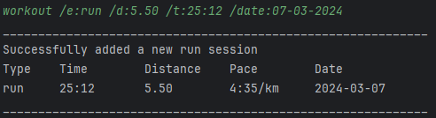

5. Now, let's put the **second** run's details into the flags required:

    - A **20km** run is specified using the `distance` flag via `/d:20.00`.
    - **2 hours, 13 minutes and 37 seconds** is specified using the `time` flag via `/t:02:13:37`
    - **No date** is given, so we can leave the `date` blank.

6. The full command for the second run is:

    <code style="color: #D85D43;">workout /e:run /d:20.00 /t:02:13:37</code>

7. Entering it into PulsePilot shows the following:

    

8. Congratulations! You have added your first 2 runs to PulsePilot!

##### Error Messages

> ❗ This is just one example of invalid input. We will not cover the full list of errors here.

Adding an incorrect flag will cause the command for adding a run to be **invalid** and PulsePilot will not add anything. 

For example, if you used `/time:` instead of `/t:`

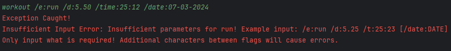

###### [Back to PulsePilot Commands](#pulsepilot-commands)

###### [Back to table of contents](#table-of-contents)

---

#### Add Gym

To add a gym, there are 2 parts to the command:

1. Adding a gym itself using `workout /e:gym`.
2. Adding details for each individual gym station.

To tell PulsePilot to add a gym, the following details are required:

| Detail               | Description                                                       | Flag Used | Limitations                                                                                                                                                                  |
|----------------------|-------------------------------------------------------------------|-----------|------------------------------------------------------------------------------------------------------------------------------------------------------------------------------|
| `number of stations` | The number of gym stations you have done in one gym session.      | `/n:`     | Must be a **positive number of at least 1**.                                                                                                                                  |
| `date`               | The date of the run.  This is an **OPTIONAL** parameter.   | `/date:`  | Must be in `DD-MM-YYYY` format.   Date specified **cannot be after today's date**. (i.e. If today is `10-04-2024`, specifying `11-04-2024` will trigger an error!)    |

> ❗ The `date` parameter is **OPTIONAL**. Not specifying one results in it being recorded as `NA` within PulsePilot, and it is okay! This is similar to the command used for adding a run.

> ❗ After using the `workout /e:gym` command, **ALL OTHER INPUTS WILL BE INVALID** as PulsePilot expects gym station parameters.

After PulsePilot receives the command to enter a gym, it will prompt you further for additional details for **each station**. If you specified the `number of stations` as `4`, then PulsePilot requires 4 extra inputs from you!

The following details are required for each station:

| Detail               | Description                                                       | Flag Used | Limitations                                                                                                                                                                  |
|----------------------|-------------------------------------------------------------------|-----------|------------------------------------------------------------------------------------------------------------------------------------------------------------------------------|
| `station name` | The name of the station done.    | **No flag required.**    | Can **only** have letters, and must be shorter than 25 characters.                                                                                                                                  |
| `number of sets` | The number of sets done at each station.     | `/s:`     | Must be a **positive number of at least 1**                                                                                                                                  |
| `number of repetitions` | The number of repetitions done at each station.     | `/r:`     | Must be a **positive number of at least 1**                                                                                                                                  |
| `weights` | The weight done for each set in **kilograms**, separated by commas.   (i.e. If you have used 70kg and 75kg at one station, use `70,75` to specify that.)     | `/w:`     | Must **only contain numbers and commas**, as all other characters will trigger errors.    Each number specified must be a multiple of `0.125`.       Numbers specified **must be at least 0, and less than 2850**.                                                                                                                                  |

The following example will cover how to add a gym session step-by-step.

1. Suppose you want to add a **gym session**, where you did **3 stations on 10 March 2024**. Here is the breakdown of your workout:

    - Station 1: 4 sets of 4 repetitions of Bench Press using 100kg, 105kg, 110kg and 112.5kg respectively.
    - Station 2: 5 sets of 5 repetitions of Deadlift using 150kg, 150kg, 160kg, 160kg and 170kg respectively.
    - Station 3: 3 sets of 10 repetitons of Squats using 100.5kg, 115kg and 110kg respectively.

2. Let's put the gym details into the flags required:

    - **3 gym stations** is specified using the `number of stations` flag via `/n:3`.
    - **10 March 2024** is specified using the `date` flag via `/date:10-03-2024`.

3. Putting it together, the full command is:

    <code style="color: #D85D43;">workout /e:gym /n:3 /date:10-03-2024</code>

4. Entering it into PulsePilot results in the gym station prompt to be printed:

    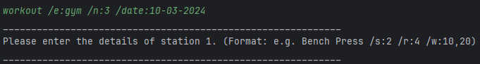

5. Now, we can put the 3 gym stations into the flags required:

    - Station 1: `Bench Press /s:4 /r:4 /w:100,105,110,112.5`
    - Station 2: `Deadlift /s:5 /r:5 /w:150,150,160,160,170`
    - Station 3: `Squat /s:3 /r:10 /w:100.5,115,110`

6. Enter the inputs into PulsePilot. New prompts are printed for each station, and a success message is printed once added. If done correctly, the output should look like this:

    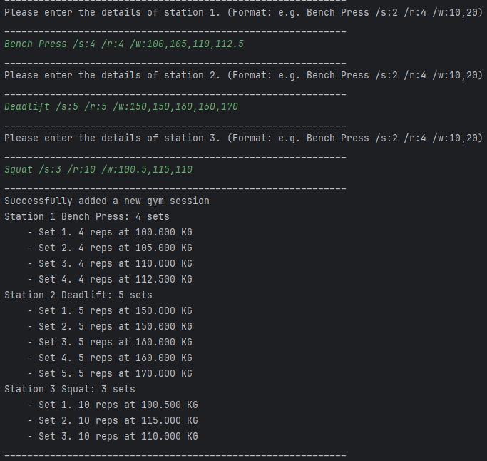

7. Congratulations! You have successfully added a gym session to PulsePilot!

###### [Back to PulsePilot Commands](#pulsepilot-commands)

###### [Back to table of contents](#table-of-contents)

---

### Health

###### [Back to PulsePilot Commands](#pulsepilot-commands)

###### [Back to table of contents](#table-of-contents)

---

#### Add Period

###### [Back to PulsePilot Commands](#pulsepilot-commands)

###### [Back to table of contents](#table-of-contents)

---

#### Add BMI

###### [Back to PulsePilot Commands](#pulsepilot-commands)

###### [Back to table of contents](#table-of-contents)

---

#### Add Appointment

###### [Back to PulsePilot Commands](#pulsepilot-commands)

###### [Back to table of contents](#table-of-contents)

---

#### Make Period Prediction

###### [Back to PulsePilot Commands](#pulsepilot-commands)

###### [Back to table of contents](#table-of-contents)

---

### View History

###### [Back to PulsePilot Commands](#pulsepilot-commands)

###### [Back to table of contents](#table-of-contents)

---

### View Latest

###### [Back to PulsePilot Commands](#pulsepilot-commands)

###### [Back to table of contents](#table-of-contents)

---

### Delete Item

###### [Back to PulsePilot Commands](#pulsepilot-commands)

###### [Back to table of contents](#table-of-contents)

---

### Storage of Data

###### [Back to PulsePilot Commands](#pulsepilot-commands)

###### [Back to table of contents](#table-of-contents)

---

### Exit

###### [Back to PulsePilot Commands](#pulsepilot-commands)

###### [Back to table of contents](#table-of-contents)

---

## Command Summary

Here is a summary of all the commands and its functions. The table contains examples as well for you to try out!

| Action            | Format, Examples                                                                                                                                                          |
|-------------------|---------------------------------------------------------------------------------------------------------------------------------------------------------------------------|
| Print help        | `help`                                                                                                                                                                    |
| Add new run       | `workout /e:run /d:DISTANCE /t:TIME [/date:DATE]`   Example: `workout /e:run /d:5.24 /t:25:23 /date:19-03-2024`                                                    |
| Add gym           | `workout /e:gym /n:NUMBER_OF_STATIONS [/date:DATE]`   Example: `workout /e:gym /n:4`                                                                               |
| Track BMI         | `health /h:bmi /height:HEIGHT /weight:WEIGHT /date:DATE`   Example: `health /h:bmi /height:1.70 /weight:75.42 /date:19-03-2024`                                    |
| Track Period      | `health /h:period /start:START_DATE [/end:END_DATE]`   Example: `health /h:period /start:09-03-2022 /end:16-03-2022`                                               |
| Track Appointment | `health /h:appointment /date:DATE /time:TIME /description:DESCRIPTION`   Example: `health /h:appointment /date:29-04-2025 /time:12:00 /description:knee surgery`   |
| View history      | `history /item:TYPE`   Example: `history /item:run`                                                                                                                |
| View latest       | `latest /item:TYPE`   Example: `latest /item:bmi`                                                                                                                  |
| Deleting item     | `delete /item:TYPE /index:INDEX`   Example: `delete /item:run /index:1`                                                                                            |
| Exit bot          | `exit`                                                                                                                                                                    |

###### [Back to table of contents](#table-of-contents)

---

## Common Problems

### Odd Characters on Screen

In some instances, the output from an error will result in odd characters being printed on screen:

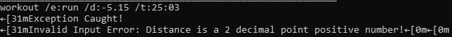

This issue affects Windows machines. The odd characters are actually special characters used to **display colour** in the terminal. **Windows 10 users** do not have this enabled by default. For Windows 11, these are automatically enabled and hence this problem does not occur.

This is what the output is supposed to look like when the same command is used on a Windows 11 computer:

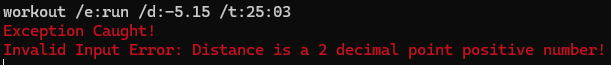

This merely a visual difference, and it does not mean PulsePilot is not working. **You can safely ignore this and continue using PulsePilot.**

> 💡 These 'special characters' are actually called [ANSI escape sequences](https://en.wikipedia.org/wiki/ANSI_escape_code). If you want to view PulsePilot in colour, please enable them for your Windows computer using [this guide](#https://www.youtube.com/watch?v=HeJOyEw3RtM). **MacOS and Linux users are unaffected!**

###### [Back to PulsePilot Text Style](#pulsepilot-text-style)

###### [Back to table of contents](#table-of-contents)

---

## Frequently Asked Questions

###### [Back to table of contents](#table-of-contents)

---

## Glossary

| Term                        | Definition                                                                                                                                                                                                                                                           |
|-----------------------------|----------------------------------------------------------------------------------------------------------------------------------------------------------------------------------------------------------------------------------------------------------------------|
| Object-Oriented Programming | A programming paradigm aiming used to guide the the analysis and structure of solutions by programmers in a specific way.   [*Go Back*](#glossary-usage)                                                                                                      |
| Hyperlinks                  | A reference to data that a user can follow by clicking on, which can point to an entire document or specific part of document.  [*Go Back*](#glossary-usage)                                                                                                  |
| Java                        | A programming language that was created to run programs **any operating system**. It was created based on the 'write once, run anywhere' philosophy.  [*Go Back*](#glossary-usage)                                                                            |
| Command Line Interface      | A **text-based** interface where users can input commands that interact with a computer.  [*Go Back*](#command-line-interface)                                                                                                                                |
| Directory / Directories     | A folder within your computer that contains other files and files. [*Go Back*](#launching-cmdexe)                                                                                                                                                             |
| Github                      | A platform that allows developers to create, store, manage , collaborate and share their code and applications.  [*Go Back*](#installing-and-launching-pulsepilot)                                                                                            |
| Alphanumeric                | Input that is made up of only **letters and numbers**.  [*Go Back*](#creating-your-profile)                                                                                                                                                                   |
| Flags                       | Flags in PulsePilot, like `/date:` or `/t:` are special signs used to tell it what information the user is giving. For example, the input `/date:20-04-2023` is used to tell PulsePilot that the date is 20 April 2023.   [*Go Back*](#pulsepilot-commands)   |
| File Explorer               | An application used to view the files and directories in a Windows computer.  The program uses this logo:      [*Go Back*](#windows-fix)                                   |

###### [Back to table of contents](#table-of-contents)

---
